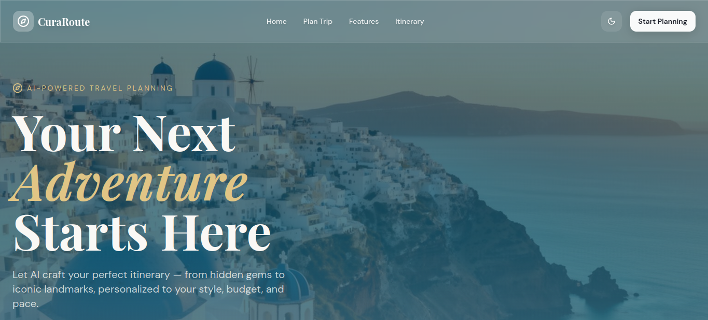
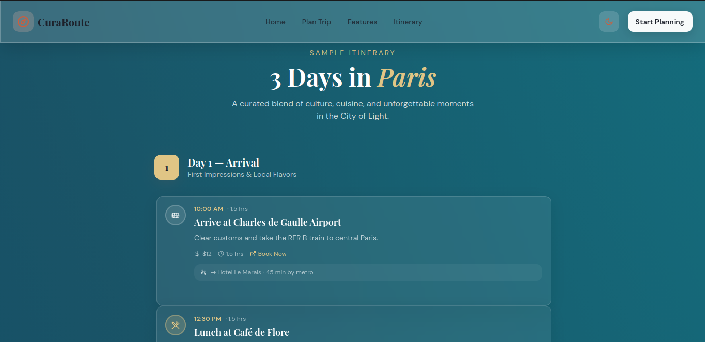
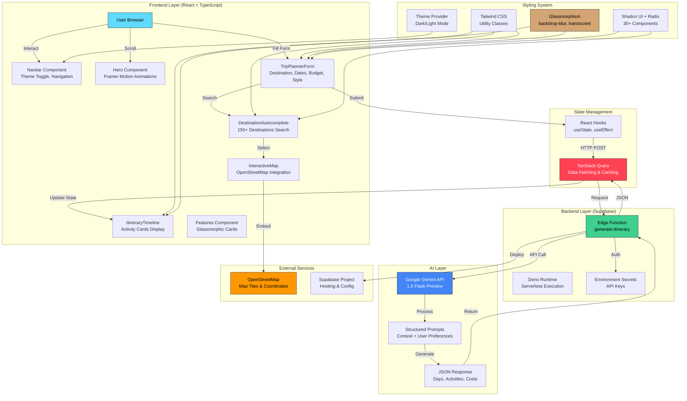
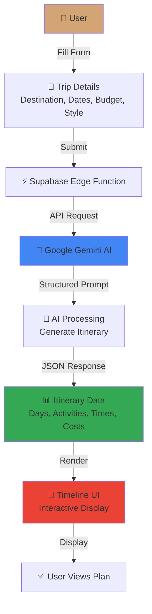

<div align="center">
  
  
  
  
  
</div>

<br />

<div align="center">
  <h1>🌍 CuraRoute</h1>
  <p><strong>AI-Powered Travel Itinerary Planner</strong></p>
  <p>Create personalized trip plans in seconds with Google Gemini AI</p>
</div>

<br />

<div align="center">
  
  
  
</div>

---

## ✨ Features

- **Smart Destination Search** - Autocomplete with 150+ destinations worldwide
- **AI-Generated Itineraries** - Get detailed day-by-day plans with activities, dining, and transit
- **Interactive Maps** - Visualize your destinations with embedded OpenStreetMap
- **Travel Style Matching** - Choose from adventure, cultural, relaxation, foodie, romantic, or family trips
- **Budget Planning** - Customize itineraries based on your budget range
- **Dark/Light Theme** - Glassmorphic UI with system-aware theme switching
- **Mobile Responsive** - Works seamlessly on all devices

## � Screenshots

<div align="center">
  
  <p><em>Beautiful glassmorphic hero section with AI-powered planning</em></p>
</div>

<br />

<div align="center">
  
  <p><em>Interactive timeline view with day-by-day activities</em></p>
</div>

<div align="center">
  
  <p><em>Overview of the CuraRoute
</div>

## �🛠️ Tech Stack

**Frontend**
- React 18 with TypeScript
- Vite for blazing fast builds
- Tailwind CSS for styling
- Shadcn UI + Radix UI components
- Framer Motion for animations
- TanStack Query for data fetching

**Backend**
- Supabase Edge Functions (serverless)
- Google Gemini 1.5 Flash for AI generation

## 🏗️ Architecture



### Architecture Layers

**🎨 Frontend (Client-Side)**
- Built with React 18 + TypeScript + Vite
- Component-based architecture with reusable UI elements
- Glassmorphic design with backdrop-blur effects
- Real-time search with 150+ pre-loaded destinations
- Interactive maps with OpenStreetMap embedding
- TanStack Query for efficient data fetching and caching

**⚡ Backend (Serverless)**
- Supabase Edge Functions running on Deno
- Single endpoint: `/functions/v1/generate-itinerary`
- Validates user input and constructs AI prompts
- Secure API key management via Supabase secrets

**🤖 AI Layer**
- Google Gemini 1.5 Flash for rapid generation
- Structured prompts with travel preferences
- Returns detailed JSON itineraries with timing and costs

**🗺️ External Services**
- OpenStreetMap for destination visualization
- Supabase for hosting and configuration

## 🚀 Getting Started

### Prerequisites

- Node.js 16+ and npm/bun
- Supabase account
- Google AI API key (Gemini)

### Installation

```bash
# Clone the repo
git clone https://github.com/yourusername/curaroute.git
cd curaroute

# Install dependencies
npm install

# Start dev server
npm run dev
```

The app will be available at `http://localhost:8080`

### Environment Setup

You'll need to configure environment variables for Supabase and the AI generation function.

**For local development**, create a `.env` file:

```env
VITE_SUPABASE_URL=your_supabase_project_url
VITE_SUPABASE_PUBLISHABLE_KEY=your_supabase_anon_key
```

**For the Supabase Edge Function**, set these secrets:

```bash
supabase secrets set GEMINI_API_KEY=your_google_ai_api_key
```

## 📁 Project Structure

```
src/
├── components/          # React components
│   ├── ui/             # Reusable UI components (buttons, inputs, etc)
│   ├── Hero.tsx        # Landing hero section
│   ├── Navbar.tsx      # Navigation with theme toggle
│   ├── TripPlannerForm.tsx
│   ├── ItineraryTimeline.tsx
│   └── Features.tsx
├── pages/              # Route pages
├── hooks/              # Custom React hooks
├── lib/                # Utility functions
└── integrations/       # External service integrations

supabase/
└── functions/
    └── generate-itinerary/  # Edge function for AI generation
```

## 📦 Building for Production

```bash
npm run build
```

Output goes to `dist/` and can be deployed to Vercel, Netlify, or any static host.

## 🔄 How It Works



### Flow Breakdown

1. **User Input** - Fill out the trip planning form with destination, dates, budget, and travel style
2. **Request Handling** - Form data is sent to a Supabase Edge Function (serverless)
3. **AI Generation** - Edge function calls Google Gemini with structured prompts
4. **Data Processing** - AI generates detailed itinerary with activities, timing, and costs
5. **UI Rendering** - Results are displayed in a beautiful glassmorphic timeline view

## 🤝 Contributing

Feel free to open issues or submit PRs. This is a personal project but contributions are welcome.

## 📄 License

MIT

